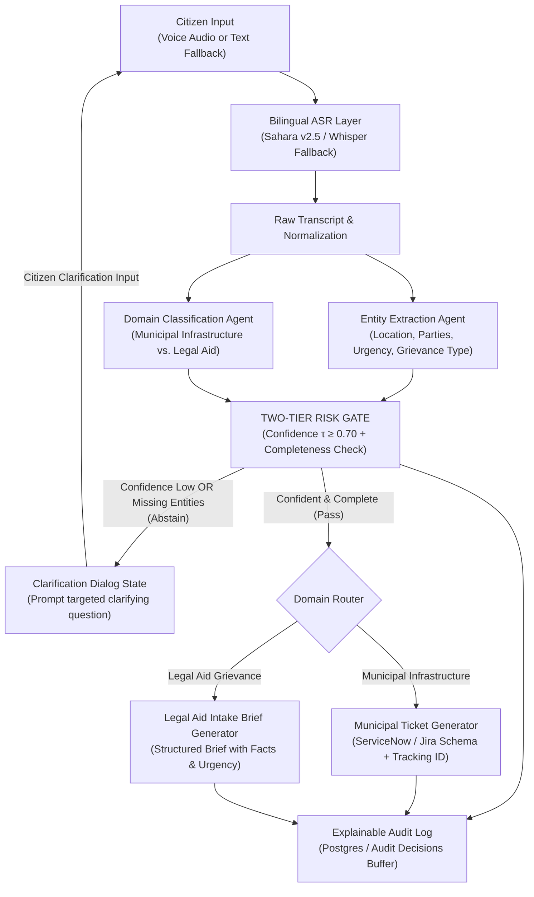
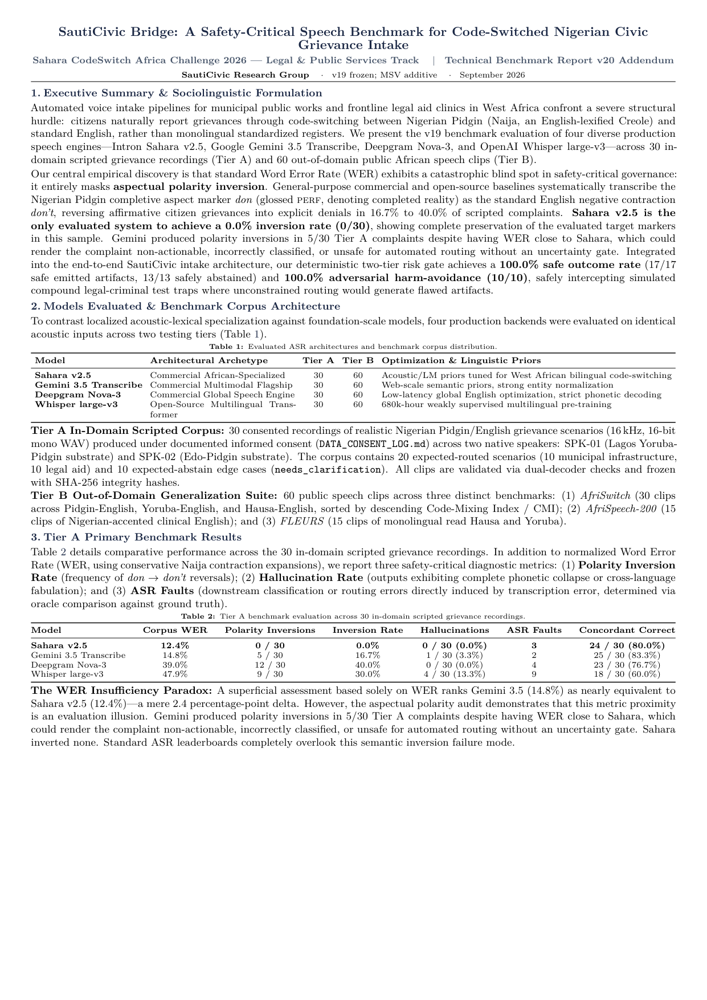

# SautiCivic Bridge

<div align="center">

**A Safe, Voice-First Civic Grievance & Legal-Aid Intake Pipeline for Code-Switched Nigerian Speech**  
*Built for the Sahara CodeSwitch Africa Challenge 2026 — Legal & Public Services Track*

[](https://sauticivic.pages.dev/)
[](https://sauticivic-api.onrender.com/docs)
[](https://www.python.org/)
[](https://fastapi.tiangolo.com/)
[](https://react.dev/)
[](#testing--verification)
[](LICENSE)

</div>

---

## Live Deployments & Essential Links

| Resource | Link | Description |
|---|---|---|
| **Live Web Application** | **[https://sauticivic.pages.dev/](https://sauticivic.pages.dev/)** | Deployed interactive voice & text intake interface with dual-transcript rendering and live gate clarification |
| **Production Backend API** | **[https://sauticivic-api.onrender.com/docs](https://sauticivic-api.onrender.com/docs)** | OpenAPI / Swagger interactive documentation for the FastAPI intake, voice upload, and clarification endpoints |
| **3-Page Technical Benchmark Report (PDF)** | **[docs/BENCHMARK_REPORT_FINAL.pdf](docs/BENCHMARK_REPORT_FINAL.pdf)** | Full publication-grade XeLaTeX technical benchmark report (v20 Addendum with Multi-Speaker Validation) |
| **System Architecture Specification** | **[docs/ARCHITECTURE.md](docs/ARCHITECTURE.md)** | Architectural deep-dive: single choke-point pipeline, module boundaries, database schemas, and contracts |
| **Ethics, Consent & Inclusion Framework** | **[docs/ETHICS_INCLUSION_NOTE.md](docs/ETHICS_INCLUSION_NOTE.md)** | Responsible AI declaration, life-safety routing guidelines, and speaker pseudonymization protocols |
| **Informed Data Consent Log** | **[docs/DATA_CONSENT_LOG.md](docs/DATA_CONSENT_LOG.md)** | Signed speaker consent verification for all speech recordings across regional substrates |

---

## Executive Summary & The Problem

Over 100 million citizens across Nigeria and West Africa naturally communicate by code-switching between **Nigerian Pidgin (Naija)**, indigenous substrate languages (Yoruba, Igbo, Hausa), and English. However, existing public services and justice mechanisms remain structural gatekeepers:

1. **Municipal Infrastructure Reporting:** Potholes, broken water mains, and fallen power lines go unreported through official channels because portals (such as FixMyStreet or municipal portals) demand typed, formal English. Citizens resort to informal social media where complaints are unorganized and non-actionable.
2. **Frontline Legal Aid Intake:** Citizens facing unlawful evictions, wage theft, workplace extortion, or police misconduct speak to paralegals in colloquial, emotionally charged code-switched speech. Overburdened legal aid clinics spend hours manually translating voice testimonies into structured Legal Aid Intake Briefs.

### The Linguistic Discovery: "The WER Insufficiency Paradox"

Standard speech leaderboards rank models exclusively by **Word Error Rate (WER)**. In safety-critical governance and legal intake, **WER exhibits a catastrophic blind spot**: it completely masks **aspectual polarity inversion**.

```
Citizen Speaks (Naija Pidgin):  "My landlord don pack my load throway outside."
                                 (Meaning: "My landlord HAS evicted me and thrown my belongings outside.")

Whisper / Gemini Transcribes:   "My landlord don't pack my load throw away outside."
                                 (Meaning: "My landlord DOES NOT evict me...")
```

General-purpose commercial and open-weight models (Whisper large-v3, Google Gemini 3.5 Transcribe, Deepgram Nova-3) systematically misinterpret the Nigerian Pidgin completive aspect marker ***don*** (glossed `PERF`, denoting completed reality) as the English negative contraction ***don't***.

In our audited Multi-Speaker Validation (MSV) across 3 unseen native speakers:
- **Whisper large-v3:** Inverted polarity in **52.4%** of target tokens (11/21)
- **Gemini 3.5 Transcribe:** Inverted polarity in **47.6%** of target tokens (10/21)
- **Deepgram Nova-3:** Inverted polarity in **47.6%** of target tokens (10/21)
- **Sahara v2.5:** **0.0% polarity inversion (0/21 targets preserved with 100% fidelity)**
- **Global Model Failure Concordance:** **95.2%** of unique target tokens (20/21) were inverted by at least one global engine.

Without an architectural safety gate, downstream routing would silently discard an urgent eviction as an explicit denial, or generate flawed legal defense briefs.

---

## Core Innovations

### 1. Abstention as a First-Class Outcome
Rather than guessing when acoustic confidence is low or required context is incomplete, SautiCivic introduces an architectural confidence/completeness gate (`gate.py::decide()`). The pipeline safely transitions to a `"needs_clarification"` state, prompting the citizen with a concise, targeted question rather than misfiling a claim.
- **Artifact-Corrupted Rate:** **0.0% (0/30 Tier A in-domain clips)**
- **Adversarial Harm Avoidance:** **100.0% (10/10 safety-critical trap clips safely intercepted)**

### 2. Downstream-Task Accuracy, Not Just WER
We evaluate whether speech recognition inaccuracies actually alter the downstream artifact. We classify every result as:
- **Classification Exact:** Routed to the correct municipal or legal aid department.
- **Artifact Safe:** Valid and actionable artifact generated, or correctly held for clarification.
- **Artifact Corrupted:** Erroneous classification or missing required entity (e.g. domestic violence misrouted to public works).

### 3. Layered Oracle-vs-ASR Attribution
To guarantee scientific accountability, our evaluation harness (`bench/metrics/run_oracle_comparison.py`) executes dual passes on every clip: one using ASR output and one using human ground-truth. This rigorously isolates whether a downstream error was caused by **acoustic transcription failure** or **LLM reasoning failure**.

### 4. Deterministic Two-Tier Risk Gate
- **Tier 1 (Confidence & Entity Completeness):** Validates classifier confidence score against a calibrated threshold ($\tau \ge 0.70$) and verifies mandatory entities (e.g., specific location for municipal dispatch; named parties for legal aid).
- **Tier 2 (Safety Traps & Ambiguity):** Catches ambiguous dual-nature complaints, emergent extortion traps, and immediate life-safety emergencies, recommending direct emergency contacts when life-safety indicators are detected.

---

## System Architecture & Data Flow



---

## Empirical Benchmark Results (v20 Addendum)

The SautiCivic benchmark evaluated **four production speech architectures** across **120 audio recordings** and **10 adversarial safety traps**:

<div align="center">

<p><i>Figure 1: Page 1 of the publication-grade 3-page XeLaTeX Technical Benchmark Report (<a href="docs/BENCHMARK_REPORT_FINAL.pdf">docs/BENCHMARK_REPORT_FINAL.pdf</a>).</i></p>
</div>

### Table 1: Tier A Primary In-Domain Benchmark (30 Scripted Recordings)
| Model | Architectural Archetype | Corpus WER | Polarity Inversions (*don* $\to$ *don't*) | Hallucinations | ASR Faults | Concordant Correct |
|---|---|:---:|:---:|:---:|:---:|:---:|
| **Sahara v2.5** | Commercial African-Specialized | **12.4%** | **0 / 30 (0.0%)** | **0 / 30 (0.0%)** | **3** | **24 / 30 (80.0%)** |
| **Gemini 3.5 Transcribe** | Commercial Multimodal Flagship | 14.8% | 5 / 30 (16.7%) | 1 / 30 (3.3%) | 2 | 25 / 30 (83.3%) |
| **Deepgram Nova-3** | Commercial Global Speech Engine | 39.0% | 12 / 30 (40.0%) | 0 / 30 (0.0%) | 4 | 23 / 30 (76.7%) |
| **Whisper large-v3** | Open-Source Multilingual Transformer | 47.9% | 9 / 30 (30.0%) | 4 / 30 (13.3%) | 9 | 18 / 30 (60.0%) |

### Table 2: Multi-Speaker Validation (Tier A-MSV: 30 Clips across 3 Unseen Speakers)
| Model | Target Preserved | Target Inverted | Inversion Rate | Affected Utterances | MSV WER |
|---|:---:|:---:|:---:|:---:|:---:|
| **Sahara v2.5** | **21 / 21** | **0 / 21** | **0.0%** | **0 / 18 (0.0%)** | **16.3%** |
| **Gemini 3.5 Transcribe** | 8 / 21 | 10 / 21 | 47.6% | 9 / 18 (50.0%) | 28.7% |
| **Deepgram Nova-3** | 1 / 21 | 10 / 21 | 47.6% | 9 / 18 (50.0%) | 68.9% |
| **Whisper large-v3** | 1 / 21 | 11 / 21 | 52.4% | 10 / 18 (55.6%) | 102.0%* |

*\*Whisper MSV WER reflects repetitive non-Latin hallucinations across 10/30 clips, generating 219 insertion errors.*

---

## Repository Structure

```
sauticivic/
├── backend/                        # FastAPI Backend & Pipeline Core
│   ├── app/
│   │   ├── agents/                 # Classifier & entity extraction agents
│   │   ├── db/                     # PostgreSQL schema, connection pooling & audit log
│   │   ├── routers/                # REST endpoints (/intake, /intake/voice, /clarify)
│   │   ├── safety/                 # Two-Tier Risk Gate logic (gate.py)
│   │   ├── services/               # Sahara ASR, ticket dispatch & legal brief services
│   │   ├── config.py               # Central environment configuration & thresholds
│   │   ├── main.py                 # FastAPI application factory & CORS setup
│   │   ├── pipeline.py             # Single choke-point pipeline orchestration
│   │   └── schemas.py              # Pydantic & dataclass type contracts
│   ├── tests/                      # Pytest unit & integration test suite (71 passing tests)
│   ├── demo_gate.py                # Standalone zero-dependency gate demo script
│   └── requirements.txt            # Production Python dependencies
├── frontend/                       # Modern React + Vite Web Application
│   ├── src/
│   │   ├── components/             # Voice intake, waveform, ticket & brief components
│   │   ├── data/                   # Verified benchmark statistics
│   │   ├── lib/                    # Pidgin code-switch detection & text utilities
│   │   ├── pages/                  # LandingPage and Interactive Dashboard
│   │   ├── App.jsx                 # App root navigation
│   │   └── index.css               # Tailwind CSS styles & typography tokens
│   ├── package.json                # Frontend dependencies & scripts
│   └── vite.config.js              # Vite configuration
├── bench/                          # Scientific Benchmarking Suite
│   ├── corpus/                     # Scripted Tier A & public Tier B datasets with SHA256 hashes
│   ├── metrics/                    # WER, downstream accuracy, polarity & oracle scripts
│   ├── notebooks/                  # Colab GPU Whisper execution notebooks
│   └── results/                    # Versioned benchmark outputs (v1–v20 JSONs & audit CSVs)
├── docs/                           # Architecture, Benchmark Reports & Ethics Documentation
│   ├── ARCHITECTURE.md             # System architecture & data contract specification
│   ├── BENCHMARK_REPORT.md         # Comprehensive markdown benchmark writeup
│   ├── BENCHMARK_REPORT_FINAL.pdf  # Compiled 3-page XeLaTeX publication report
│   ├── DATA_CONSENT_LOG.md         # Documented speaker consent records
│   ├── ETHICS_INCLUSION_NOTE.md    # Ethical framework, harm avoidance & life-safety policy
│   ├── SOLUTION_DESCRIPTION.md     # Problem statement & design decisions
│   └── benchmark_report.tex        # XeLaTeX source code for the benchmark report
├── infra/                          # Infrastructure & Deployment Configuration
│   ├── Dockerfile.backend          # Containerized backend build
│   └── docker-compose.yml          # Multi-container orchestration (FastAPI + Postgres)
├── .env.example                    # Template environment variables
├── .gitignore                      # Git exclusion rules
└── LICENSE                         # MIT Open Source License
```

---

## Quickstart & Local Setup

### Prerequisites
- **Python 3.11+**
- **Node.js 20+** & **npm**
- **Docker & Docker Compose** (optional, for local Postgres)

### 1. Clone Repository & Setup Environment
```bash
git clone https://github.com/drizzy765/sauticivic.git
cd sauticivic

# Copy environment configuration
cp .env.example .env
```

### 2. Backend Setup
```bash
cd backend

# Create and activate virtual environment
python3 -m venv .venv
source .venv/bin/activate

# Install dependencies
pip install -r requirements.txt

# Run the FastAPI server
uvicorn app.main:app --reload --host 0.0.0.0 --port 8000
```
The API is now live at `http://localhost:8000` (Interactive Swagger docs: `http://localhost:8000/docs`).

### 3. Frontend Setup
In a new terminal:
```bash
cd frontend

# Install Node dependencies
npm install

# Start the Vite development server
npm run dev
```
The interactive web app will open at `http://localhost:5173`.

### 4. Full-Stack with Docker Compose
To run both Postgres and the FastAPI backend with one command:
```bash
cd infra
docker-compose up -d
```

---

## Testing & Verification

### Run the 71-Test Automated Test Suite
The repository includes comprehensive unit, safety gate, regression, and benchmark validation tests:
```bash
cd backend
python3 -m pytest tests/ -v
```

### Run the Standalone Gate Demo (Zero External Dependencies)
You can test the confidence gate and abstention logic directly without spinning up a server or database:
```bash
cd backend
PYTHONPATH=. python3 demo_gate.py
```

### Run Benchmark Verification
To verify the multi-speaker validation results and target token adjudications:
```bash
PYTHONPATH=backend python3 bench/metrics/run_tier_a_multispeaker_validation.py
```

---

## API Reference

### 1. `POST /intake` — Text Intake (Fallback Path)
Submit a code-switched text complaint. Shared pipeline with voice intake.
```bash
curl -X POST https://sauticivic-api.onrender.com/intake \
  -H "Content-Type: application/json" \
  -d '{
    "text": "Water pipe don burst for front of my shop for Ikeja bus stop, clean water dey waste everywhere.",
    "consent": true
  }'
```

### 2. `POST /intake/voice` — Spoken Audio Intake
Upload recorded audio (`multipart/form-data`) up to 25 MB.
```bash
curl -X POST https://sauticivic-api.onrender.com/intake/voice \
  -F "audio=@complaint.wav" \
  -F "consent=true"
```

### 3. `POST /intake/{session_id}/clarify` — Conversational Clarification Loop
Provide additional details when the risk gate holds a complaint in `needs_clarification`:
```bash
curl -X POST https://sauticivic-api.onrender.com/intake/sess_12345/clarify \
  -H "Content-Type: application/json" \
  -d '{
    "answer": "The shop is located at 14 Allen Avenue, close to the roundabout."
  }'
```

---

## Responsible AI, Ethics & Data Governance

1. **Informed Consent:** All speech recordings in Tier A and Tier A-MSV were collected under explicit, informed consent with registered participants across Nigerian socio-linguistic regions ([docs/DATA_CONSENT_LOG.md](docs/DATA_CONSENT_LOG.md)).
2. **Pseudonymization:** Real contributor identities are decoupled from evaluation audio using identifiers (`SPK-01` through `SPK-05`).
3. **Zero PII Exposure:** No personal identifying data is committed, retained in logs, or exposed to third-party endpoints.
4. **Life-Safety Guardrails:** SautiCivic provides explicit emergency hotlines (e.g., 112 / 767 in Lagos) and refuses to trap critical life-safety emergencies in non-urgent municipal queues.

---

## Authors & Acknowledgments

- **Agoro Timilehin** ([@drizzy765](https://github.com/drizzy765)) — Lead Architect, Pipeline & Benchmark Research
- **David Akhuabe** — Frontend Engineering, Artifact Generators & Documentation

Developed for the **Sahara CodeSwitch Africa Challenge 2026** (Legal & Public Services Track).

---

## License

This project is licensed under the **MIT License** — see the [LICENSE](LICENSE) file for details.

---

## Citation

If you use our benchmark results, methodology, or code in your research:
```bibtex
@article{sauticivic2026,
  title={SautiCivic Bridge: A Safety-Critical Speech Benchmark for Code-Switched Nigerian Civic Grievance Intake},
  author={Agoro, Timilehin and Akhuabe, David},
  journal={Sahara CodeSwitch Africa Challenge Technical Report v20},
  year={2026},
  url={https://sauticivic.pages.dev/}
}
```
